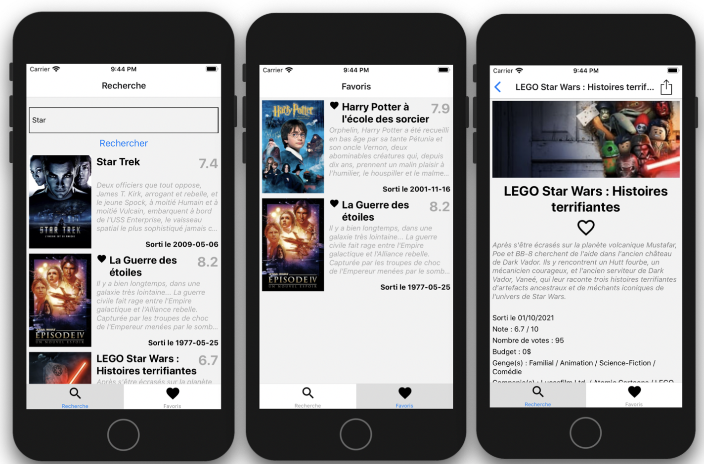

#  Application mobile permettant de chercher et de gérer vos films
# # 
- Rechercher et afficher une liste de films récupérée depuis une URL ;

- Gérer les données de l'application en annotant des films en favoris ;

- Partager des films avec vos contacts avec le partage iOS / Android ;

- Utiliser les composants natifs du téléphone, en prenant une photo ou en la sélectionnant dans votre galerie ;

- Des animations pour customiser application.

#
